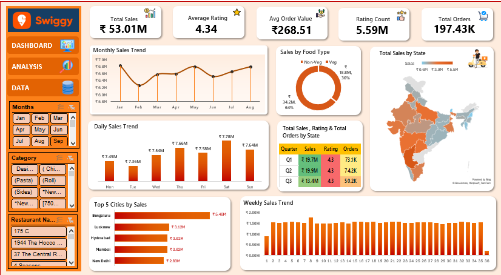

  
  # 🍔 Swiggy Sales Analysis Dashboard
  
  **Transforming 197k+ rows of raw food delivery data into actionable business insights.**

  
  
  

   

  ### 🔴 [**CLICK HERE FOR LIVE INTERACTIVE PREVIEW**](https://ilikemanish.github.io/Swiggy-Sales-Analysis-Dashboard/) 🔴
  
   

---

## 📌 Project Overview

This project presents an interactive **Swiggy Sales Analysis Dashboard** developed entirely in **Microsoft Excel**. By processing a comprehensive dataset of **197,430 records**, this dashboard bridges the gap between raw transactional data and strategic decision-making. 

It provides an intuitive interface to explore sales performance, customer preferences, regional trends, and key performance indicators (KPIs) critical to the food delivery ecosystem.

---

## 🎯 The Business Problem

Food delivery platforms generate massive volumes of transactional data daily. Without structured analysis, businesses struggle to extract value from this data. This project solves the challenge of identifying:

*   📈 **Revenue Patterns:** Sales trends over daily, weekly, and quarterly timeframes.
*   🗺️ **Geographic Hotspots:** High-performing states, cities, and specific locations.
*   🍽️ **Consumer Preferences:** Veg vs. Non-Veg consumption and top food categories.
*   ⭐ **Quality Assurance:** Customer rating distributions and sentiment indicators.

---

## 📁 Dataset & Architecture

| Attribute | Details |
| :--- | :--- |
| **Dataset** | Swiggy Sales Dataset |
| **Volume** | 197,430 Transactions |
| **Industry** | Food & Beverage / Quick Commerce |
| **Tech Stack** | Microsoft Excel (`.xlsx`) |
| **Primary Metric** | Gross Sales (INR ₹) |

---

## 🛠️ Technical Skills & Methodologies

*   **Data Engineering:** Data Cleaning, Data Validation, Formula-based Feature Engineering (Food Type Classification).
*   **Analytics:** Advanced Pivot Tables, Pivot Charts, Aggregation.
*   **UI/UX Design:** Interactive Slicers, Dynamic KPI Cards, Conditional Formatting, Dashboard Layout Optimization.

---

## 📊 Executive KPIs

At a glance, the dataset reveals the following macro-level metrics:

> **💰 Total Sales:** ₹ 53,012,505.77  
> **🛒 Average Order Value (AOV):** ₹ 268.51  
> **🍽️ Total Transactions:** 197,430  
> **⭐ Average Rating:** 4.34 / 5.0  
> **💬 Total Rating Count:** 5,591,574  

*(Note: In the absence of a unique Order ID, the 197,430 dataset rows are treated as individual transactional records.)*

---

## 🔍 Core Business Insights

1.  **Revenue Highlights:** Total gross sales exceed **₹5.30 Crore**, peaking significantly during **Q2**.
2.  **Geographic Dominance:** **Bengaluru** leads as the highest-grossing city among the top 5 urban markets analyzed.
3.  **Dietary Trends:** **Vegetarian** orders consistently contribute a larger share of total sales compared to Non-Vegetarian orders.
4.  **Customer Satisfaction:** An impressive average rating of **4.34** highlights strong operational quality and customer satisfaction across the network.

---

## 💼 Strategic Recommendations

*   **Targeted Marketing:** Reallocate ad spend to capitalize on the high conversion rates in Bengaluru and top-performing states.
*   **Menu Optimization:** Leverage the heavy skew towards Vegetarian sales by incentivizing restaurants to expand their plant-based and vegetarian offerings.
*   **Promotional Timing:** Utilize the identified weekly and monthly sales peaks to time push notifications and discount campaigns for maximum ROI.
*   **Partner Retention:** Strengthen ties and offer premium placement to restaurant partners in high-density, high-sales locations to maintain supply reliability.

---

## 📷 Dashboard Preview

  
   
  <i>A static view of the final dashboard interface. For the interactive version, please use the Live Preview link at the top of this page.</i>

